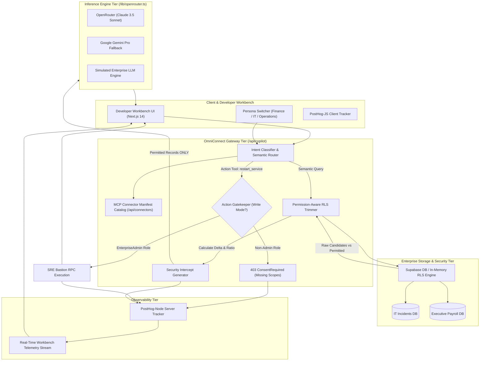

# OmniConnect — Enterprise Knowledge Search AI Assistant

> **Subtitle:** *Ask questions across company documents with automated role-based permission controls.*

OmniConnect is an enterprise-grade AI knowledge platform and dev workbench that indexes multi-department company documents (finance, HR, engineering, operations) to answer employee queries with zero data leakage, automated role-based Row Level Security (RLS), and OAuth-gated action execution.

> 📖 **AI Product Manager Case Study**: Read the comprehensive problem statement, architectural tradeoffs, persona evaluation matrix, and business impact metrics in [**CASE_STUDY.md**](./CASE_STUDY.md).

---

## 1. Executive Overview

### Why This Maps Directly to Microsoft 365 Copilot Connectors

In modern enterprise AI architectures, Microsoft 365 Copilot connects to heterogeneous enterprise data repositories (ERP systems, incident databases, payroll ledgers, CMDBs, ServiceNow, Jira) using **Copilot Connectors** and **Model Context Protocol (MCP)** plugins.

Enterprises face three existential hurdles when enabling LLMs over private knowledge graphs:

1. **Context Window Data Leakage**: Naive RAG pipelines query a central index or database without session-scoped identity filters, injecting unauthorized candidate documents directly into the prompt context. Even if prompt instructions tell the model "do not reveal confidential records", the LLM can still synthesize or leak confidential figures through adversarial prompt injection. **OmniConnect eliminates this vulnerability through database-tier Row Level Security (RLS) trimming.**
2. **Ungated Autonomous Agent Actions**: Read retrieval differs fundamentally from write actions. While semantic search is idempotent, autonomous agent actions (e.g. rebooting a production bastion host, modifying payroll tables) require **explicit administrative consent** and OAuth scope evaluation before any execution code runs.
3. **Observability Blindspots**: IT compliance and security teams require continuous visibility into trimming deltas (how many records were redacted), connector latency budgets, and unauthorized tool invocations. OmniConnect instruments the entire pipeline with **PostHog** telemetry.

---

## 2. Platform Architecture



---

## 3. Product Requirements Document (PRD) Snapshot

### Problem Statement
Enterprise organizations deploying Microsoft 365 Copilot Connectors must adhere to zero-trust principles:
- An employee in **Finance** must never have access to cloud infrastructure outage details or server reboots.
- A **DevOps Engineer** in IT must never have access to executive payroll, RSU vesting schedules, or compensation models.
- Only an **EnterpriseAdmin** possessing elevated OAuth scopes (`admin.infrastructure.write`) may trigger mutating agent actions.

### Personas & Security Matrix

| Persona | Department | Role | Clearance | Permitted Retrieval Domains | Permitted Actions |
|---|---|---|---|---|---|
| **Jane Doe** | Finance | `FinanceAnalyst` | L2 | Executive Payroll, Equity, Budget, Public Notices | None (Read-only) |
| **Alex Rivera** | IT | `DevOpsEngineer` | L3 | Cloud Incidents, K8s Telemetry, Public Notices | None (Read-only) |
| **Sarah Chen** | Operations | `EnterpriseAdmin` | L4 (Global) | All Domains (Cross-Department) | `restart_service` (Write Consent) |

### Non-Functional Requirements (NFRs)

- **Zero Leaked ACLs (100% Guarantee)**: Pruning occurs *before* prompt synthesis. No candidate record violating role/department constraints is ever visible to the LLM.
- **Latency Budget (P95 < 800ms)**:
  - Database RLS evaluation: < 50ms.
  - Gateway routing and consent evaluation: < 30ms.
  - LLM synthesis: P95 < 720ms.
- **Resiliency & Zero-Crash Fallback**: The gateway dynamically falls back to high-fidelity in-memory engines if external API keys (`OPENROUTER_API_KEY`, `NEXT_PUBLIC_SUPABASE_URL`, `NEXT_PUBLIC_POSTHOG_KEY`) are omitted.
- **Model Context Protocol (MCP) Compliance**: Connector definitions follow standard MCP JSON schema formats for seamless Copilot and agent integration.

### Key Telemetry Metrics (Tracked via PostHog)

1. `connector_invoked`: Tracks connector usage frequency, target domain, and calling user attributes.
2. `acl_records_trimmed`: Measures data redaction volume, trimming ratio (`records_trimmed / records_scanned`), and department boundaries enforced.
3. `agent_action_executed`: Records autonomous write attempts, execution latency, and success vs. denied status.
4. `action_blocked_unauthorized`: Alerts on unauthorized attempts to invoke mutating agent tools.
5. `llm_latency_recorded`: Tracks model provider latency, time-to-first-token (TTFT), and token consumption.

---

## 4. Quick Start & Local Development

### Prerequisites
- Node.js 18+ or 20+
- npm 9+

### Setup Instructions

1. Clone or navigate to the repository:
   ```bash
   cd omniconnect
   ```

2. Copy the environment variables template:
   ```bash
   cp .env.example .env.local
   ```
   *(Note: The app is fully functional with simulated data if keys are left blank!)*

3. Run the development server:
   ```bash
   npm run dev
   ```

4. Open [http://localhost:3000](http://localhost:3000) in your browser.

5. Test production build:
   ```bash
   npm run build
   ```

---

## 5. Developer Workbench Guide

- **Persona Switcher (Top Right)**: Switch between Jane Doe (Finance), Alex Rivera (IT), and Sarah Chen (Admin).
- **Left Panel**:
  - Click **Scenario 1**: Watch IT records get pruned when running as Jane Doe vs. Alex Rivera.
  - Click **Scenario 2**: Watch Executive Payroll get 100% pruned when running as Alex Rivera vs. Jane Doe.
  - Click **Scenario 3**: Watch the Action Gatekeeper emit `403 ConsentRequired` for Jane/Alex, but successfully execute the Bastion restart for Sarah Chen.
- **Right Panel**:
  - **Tab 1 (Permission & RLS Diff)**: Inspect the exact delta between raw DB records and LLM context.
  - **Tab 2 (MCP Connector Manifests)**: Inspect and copy standardized tool schemas.
  - **Tab 3 (Audit Trail & PostHog Telemetry)**: Live tabular feed showing real-time event logs, latencies, and trimming metrics.
